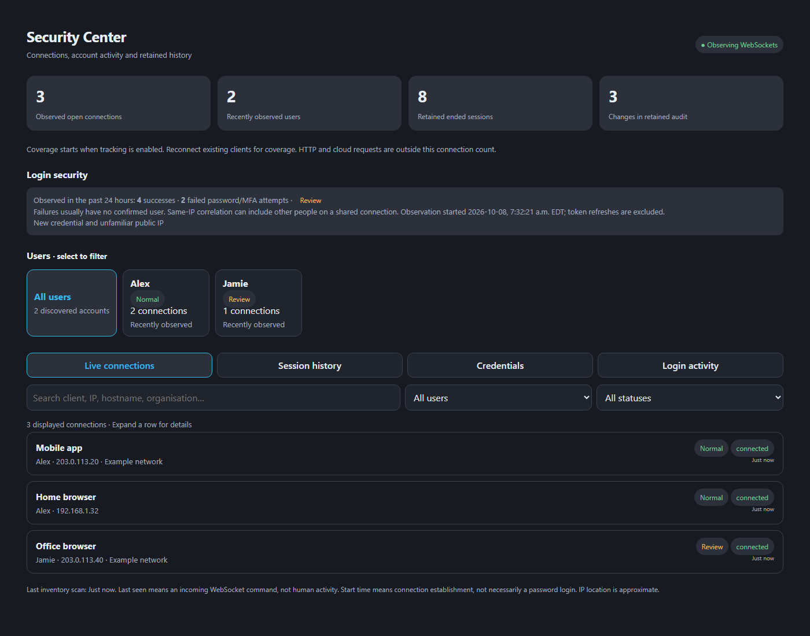

# HA Security

See who is using Home Assistant, which connections are open, and what deserves a closer look.


*Dashboard preview with sample accounts and network details.*

## What it does

- **Live connections:** view each connection's client, IP, hostname, approximate location and last activity.
- **User overview:** group security entities under each Home Assistant user, with session counts and login activity.
- **Security flags:** Normal, Review and Likely an issue, with reasons for each assessment.
- **Local history:** search ended sessions, credential changes, login outcomes and user-attributed service calls.

The dashboard includes **Live connections**, **Session history**, **Credentials** and **Login activity** tabs, with search, filters and expandable details.

## Install

1. In **HACS → Custom repositories**, add `https://github.com/Anon666333/ha-security` as an **Integration**.
2. Download the latest release and restart Home Assistant.
3. Go to **Settings → Devices & services → Add integration** and select **HA Security**.
4. In the integration's options, enable **Observe WebSocket sessions**, **Observe login outcomes** and **Expose IP/client details**. Public-IP enrichment is optional.
5. Reconnect your browser/app so existing connections can be observed.

Everything is configured through the UI—no integration YAML is needed.

## Add the dashboard

In **Settings → Dashboards → Resources**, add a **JavaScript module**:

```text
/ha_security/ha-security-card.js?v=0.1.12
```

Enable Advanced mode in your profile if Resources is hidden. Create a separate dashboard, then paste [dashboards/security.yaml](dashboards/security.yaml) into its raw configuration editor. Refresh the browser.

The card is bundled with the integration; no extra frontend repository is needed.

## A few things to know

- Connections are observed WebSockets, not a count of physical devices. Multiple tabs can share a credential.
- Login counts cover observed authorization-code successes and explicit password/MFA failures. Failed users are usually unknown; same-IP links are correlations.
- IP locations are approximate. Cellular IP changes alone do not trigger concern, and a Normal flag is not a guarantee of safety.
- History stays local. Optional enrichment sends public IPs to an external lookup service and your DNS resolver; credentials are never included.

## Updates and help

HACS installs versioned GitHub releases. After updating, restart Core and change the dashboard resource's version query to match the installed release.

Audit and session actions show user names alongside IDs and offer a user dropdown.

- [Release notes](CHANGELOG.md)
- [Configuration, troubleshooting and development reference](docs/reference.md)
- [Report an issue](https://github.com/Anon666333/ha-security/issues)

HA Security is an experimental, read-only custom integration. It does not block users or revoke credentials automatically.
